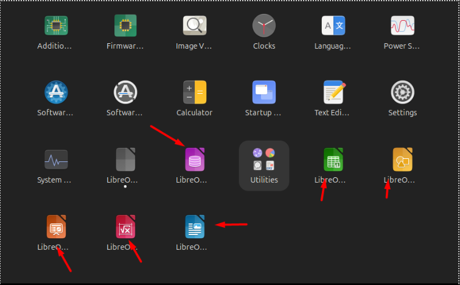
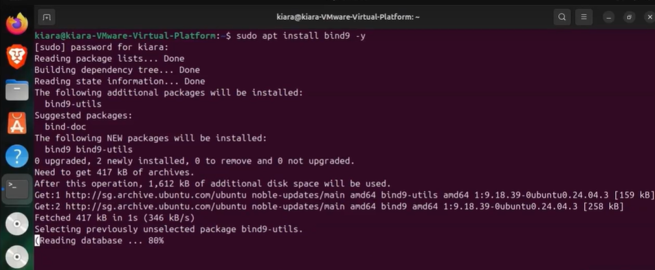
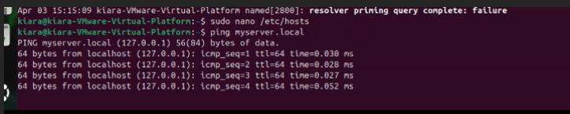
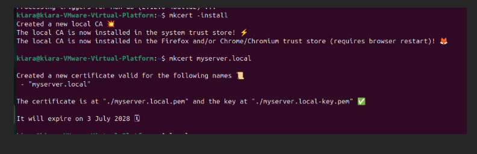
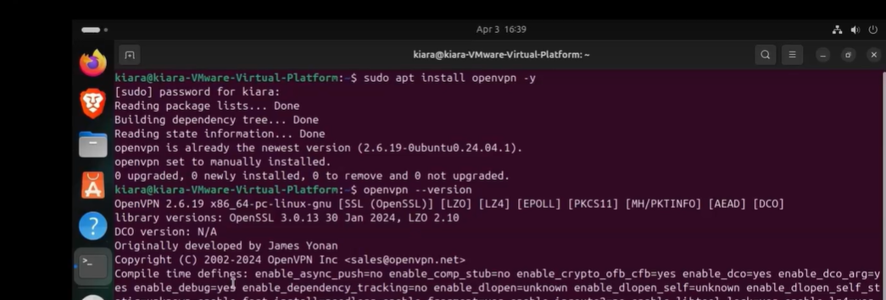
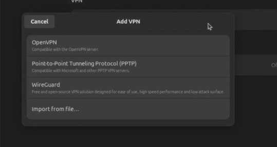

# ICT171-ISEA
Intro to Server Environment and Architectures - ICT171

Name: Teng Yi En (Kisa)

Student ID: CT0389835 | 35978369

----------------------------------
This GitHub documents my lab progress on Ubuntu Linux in VMWare
----------------------------------

Step 1:

Setting up Ubuntu:

Getting Ubuntu ISO image file from https://ubuntu.com/download/desktop

Step 2:

Updating Ubuntu:
* sudo apt update
* sudo apt upgrade
  

Checking on System Services in Ubuntu:
* systemctl list-units --type=service 
* systemctl start|stop [service]
* sudo systemctl status

Step 3:

Installing Application (VLC Media):
* sudo apt install vlc
  

Installing LibreOffie:
* sudo apt install libreoffice
  

Creating, Editing, Deleting File:
* touch file.txt
* nano file.txt
* rm file.txt

Step 4:

Configuring DNS Local Host:
* sudo apt install bind9 -y 
* sudo systemctl status bind9
* sudo nano /etc/hosts
* 127.0.0.1    myserver.local
* ping myserver.local

Step 5:

Installlation for Certificate:
* sudo apt install bind9 -y 
* sudo apt install libnss3-tools -y
* sudo apt install mkcert -y
* mkcert myserver.local

Step 6: 

Installation of OpenVPN
* sudo apt install openvpn -y 
* openvpn --version
* sudo systemctl status openvpn
* sudo apt install network-manager-openvpn -y
* sudo apt install network-manager-openvpn-gnome -y
* sudo systemctl restart NetworkManager
* sudo systemctl status NetworkManager

