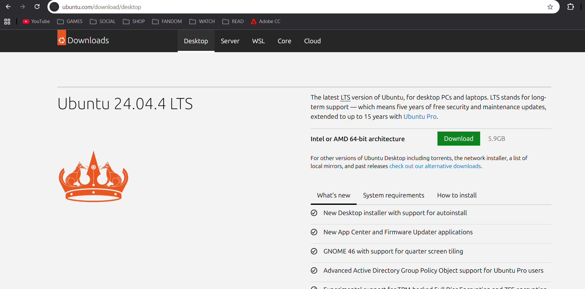
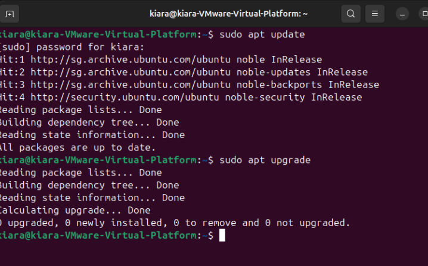
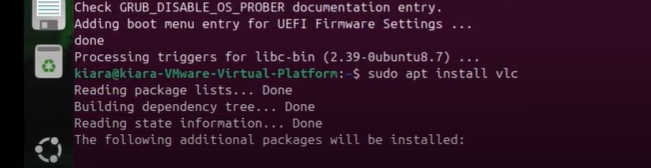

# ICT171-ISEA
Intro to Server Environment and Architectures - ICT171

Setting up Ubuntu:
Getting Ubuntu ISO image file from https://ubuntu.com/download/desktop

Updating Ubuntu:
sudo apt update | sudo apt upgrade

Checking on System Services in Ubuntu:
systemctl list-units --type=service | systemctl start|stop [service] | sudo systemctl status

Installing Application (VLC Media):
sudo apt install vlc

Installing LibreOffie:
sudo apt install libreoffice

Creating, Editing, Deleting File:
touch file.txt | nano file.txt | rm file.txt

Configuring DNS Local Host:
sudo apt install bind9 -y | sudo systemctl status bind9 | sudo nano /etc/hosts | 127.0.0.1    myserver.local | ping myserver.local

Installlation for Certificate:
sudo apt install bind9 -y | sudo apt install libnss3-tools -y | sudo apt install mkcert -y | mkcert myserver.local

Installation of OpenVPN
sudo apt install openvpn -y | openvpn --version | sudo systemctl status openvpn | sudo apt install network-manager-openvpn -y | sudo apt install network-manager-openvpn-gnome -y | sudo systemctl restart NetworkManager | sudo systemctl status NetworkManager
